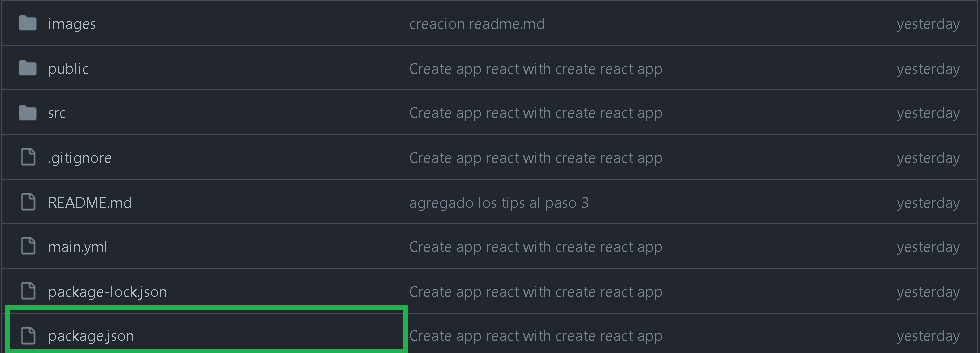

# Jedi DevOps: El challenge de un Devops Épico

¡Bienvenido, joven padawan, al changellenge donde te convertiras en un Jedi devops! Aquí encontrarás los pasos que esperemos que puedas superar para convertirte en un maestro de las galaxias en el arte de la integración y despliegue continuo.

<p align="center">
  
</p>

## Paso 1: Despliega tus poderes con una rama nueva

Primero, crea una rama develop desde la rama principal (main). ¡Que la Fuerza te acompañe!

## Paso 2: Enfrenta la prueba de la PR

Crea una Pull Request desde develop a main y prepárate para el combate. ¡Es hora de demostrar tu valía!

## Paso 3: Confronta los Quality Gates de Sonar y la seguridad de Snyk

¡Una batalla crucial! Debes crear un workflow para pasar el codigo por Sonar.

- Si los Quality Gates no se cumplen, prepárate para el combate y declina la PR.
- Si los Quality Gates son superados, aprueba la PR y crea una tarea en Jira.
  
-- __TIPS:  Para la parte del sonar debes componer dos acciones, una que realice un scan del codigo y otra que obtenga el status del Quality Gates.__

- Tras superar el análisis de Sonar, en el mismo workflow es necesario integrar un escaneo de código adicional con Snyk.


## Paso 4: Añadir a homepage property en este formato: https://{username}.github.io/{repo-name}
   1- Crearemos una rama nueva llamada `gh-pages`
   1- Añadir en el package.json:
   ```javascript
{
  "name": "my-app",
  "version": "0.1.0",
+ "homepage": "https://{username}.github.io/{repo-name}",
  "private": true,
}
  ```


  2- Configurar GitHub Pages
     Accede a la página de configuración de GitHub Pages en tu navegador web, navega hasta el repositorio de GitHub , haz clic en la pestaña "Settings".
     En la barra lateral, en la sección "Código y automatización", haga clic en "Pages"
     Configure el "Build and deployment"
        Source: Deploy from a branch
        Branch:
            Branch: gh-pages
            Folder: / (root)
     Clic en el botón "Save" 

## Paso 5: Desata el poder del merge y cierra la tarea enviando un email de despliegue correcto.

Cuando la PR sea fusionada manualmente, desencadena el flujo que llevará tu aplicación a nuevas alturas. Que el código fluya como la Fuerza misma. 

Se deberá finalizar enviando un correo que se facilitará en el challenge y asi podemos ver que es el primer equipo en finalizar. 

¡Y así, nobles guerreros, os convertiréis en verdaderos maestros Jedi del DevOps! Que la Fuerza del Código os acompañe en cada paso de vuestro viaje.


